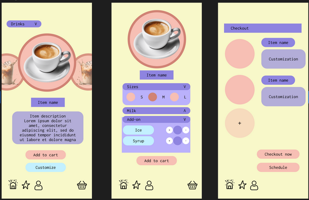

# ixd5106 - Intro Design for Interaction
Class Content from Intro Design for Interaction

***IXD5106 - Intro Design for Interaction*** is a class will introduce you to designing for both functionality and aesthetics, as well as adapting it to suit the situation.

[UX Law](https://lawsofux.com/)

>Week 1
[Occam’s Razor Presentation](https://docs.google.com/presentation/d/1Puj5MOWXFPE8DWt-2k0maY81d2oeX-6DlOYgoTZvnAg/edit?slide=id.p#slide=id.p)

>Week 3
[Underdog Coffee Challenge Presentation](https://docs.google.com/presentation/d/1bpiqnPPi64dZt_thhQFbHi4jxk_XYxl7maZk5hTCx4Q/edit?slide=id.gc6f83aa91_0_56#slide=id.gc6f83aa91_0_56)

>!NOTE
>- Figma
>- Loom